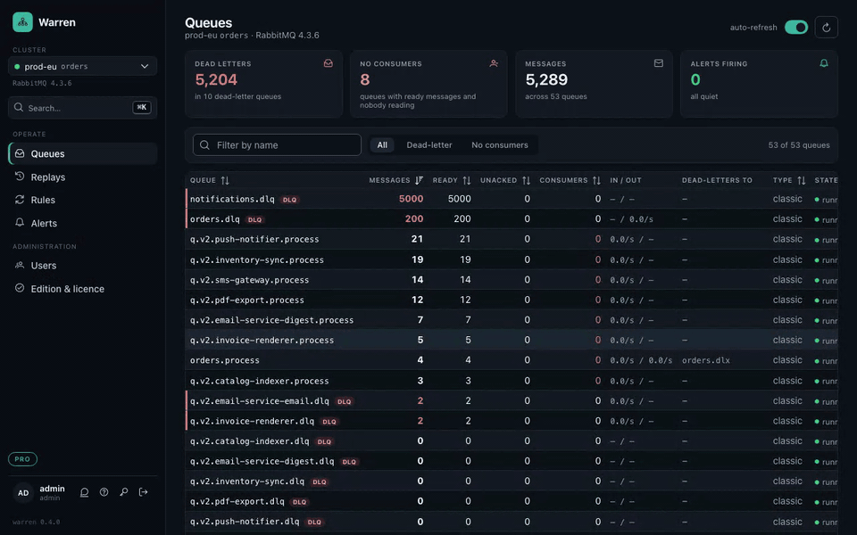

# Warren

**Dead-letter operations for RabbitMQ.** Warren shows you what is stuck in your dead-letter
queues, lets you read the actual messages, replays them with a full audit trail, keeps a
history of every queue, and alerts you before a queue becomes a problem.

The RabbitMQ management UI tells you *that* a queue has 300 messages. Warren tells you
*what* they are, *why* they died, how the number developed, and moves them back with one
click, logged, without a hand-written script at 3 a.m.



## About this repository

This is Warren's public home: the README, the compose files, the [changelog](CHANGELOG.md),
[issues](../../issues) and [discussions](../../discussions). Warren ships as a ready-to-run
container image, `ghcr.io/viba88/warren`; its source code is not published. Bug reports, feature
requests and questions are welcome here. Landing page: https://warrenops.io

## What it does

- **Multiple clusters and vhosts.** Configure any number of clusters; the same broker with
  several vhosts counts as several clusters. Switch between them in the top bar.
- **Queue overview** with dead-letter queues detected automatically (by bindings to a
  dead-letter exchange, or by name pattern) and sorted to the top, plus a bell on queues
  with a firing alert.
- **Message browser**: peek at messages without consuming them, see payload (pretty JSON),
  headers, and the complete `x-death` history: which queue rejected it, how often, when. A message a
  consumer republished itself carries no death time; "dead since" then shows how long Warren has seen
  it waiting.
  Large payloads are listed as a preview and loaded in full on demand; long embedded strings
  such as base64 attachments are collapsed to a placeholder so the fields you care about stay
  visible.
- **Replay** selected messages or the first N to their **original exchange and routing key**
  (from `x-death`), to a named queue, or to any exchange. Death headers are stripped so the
  message gets a fresh retry budget. Publisher confirms guarantee nothing is lost.
- **Throttled replay**: limit a replay to N messages per second so the consumers that just
  failed are not flooded again. A throttled replay runs in the background; its audit page
  shows the progress and the time left, and has a **Stop** button: it stops after the message it
  is on, what went stays replayed, the rest stays in the queue (status `STOPPED`).
- **Edit before replay**: select one message, fix the payload (with JSON validation), the
  content type or the headers, replay. "Remove retry bookkeeping" drops headers such as
  `x-retry-count` or `x-last-exception-*` that many consumers use to give up early, so the
  message gets a real second chance. The audit log marks the message as edited and the
  republished message carries an `x-warren-edited` header.
- **Download and publish**: download a message as JSON with its payload, properties and headers.
  Publish writes one new message to a queue or an exchange, typed in, loaded from a file (a
  downloaded message fills in everything) or as a copy of a message in the queue, for example to
  test a consumer. Nothing is taken out of any queue; the message carries `x-warren-published-by`.
  Bodies up to 1 MiB (`WARREN_MAX_PUBLISH_BYTES`).
- **Export and import**: copy the selected messages or the first N (up to 10,000) into an NDJSON
  file, one message per line in the same format as a single download; the queue keeps them and the
  audit log records who exported how many. Loading such a file in the publish dialog publishes all its
  messages to one target, as one audited action (up to 1,000 messages, 50 MiB).
- **Purge** a whole queue in one step (operators only): the discard dialog's "All messages"
  option asks for a reason. Unlike a discard it works on
  queues of any size; the audit log records who, why and how many, not the messages themselves.
  Streams cannot be purged.
- **Audit log** of every replay, discard, purge and publish: who, when, from which cluster and queue to where,
  per-message outcome. Each message can be opened as it sat in the queue: why it died,
  properties, headers, death history and the first 16 KiB of its body (for an edited message
  also what was published instead). Configure the kept head with `WARREN_AUDIT_PAYLOAD_BYTES`.
- **Keyboard**: everything is reachable without a mouse. `?` lists the shortcuts of the page;
  `/` searches it, `g q`/`g r`/`g a`/`g u` go to queues, replays, alerts and users, `c` switches
  the cluster. In a search field ↓/↑ move through the hits and Enter opens the marked one. In
  tables `j`/`k` move, Enter opens or expands, `x` selects; on a queue `r`, `d`
  and `p` replay, discard and publish. Dialogs submit with ⌘/Ctrl+Enter and pick options with
  Alt and the underlined letter. `f` puts a letter on every visible button and field, and ⌘K
  runs the page's actions too.
- **Metrics history**: every queue is sampled periodically (default 30 s, 7 days retention).
  The queue page shows messages, ready, unacked and consumers over 15 minutes to 7 days.
- **Alerting**: rules match queues by regex on one or all clusters. Conditions: messages
  above a threshold, no consumers while messages wait, growth within a time window. Each can
  require the condition to hold for a number of seconds. Notifications go to Slack, Microsoft
  Teams or any JSON webhook; firing alerts are re-notified after a configurable interval and
  a resolved notification follows when the queue recovers.
- **Users and roles**: `VIEWER` reads, `OPERATOR` replays, `ADMIN` manages alerts and users.
  Local users are managed in the UI (create, roles, enable/disable, password reset; everyone
  can change their own password). The users from configuration are only seeded on first start.
  Optionally sign in through any **OIDC** provider (Keycloak, Entra ID, Okta, …) with roles
  mapped from a claim.

## Try it in a minute

Docker is all you need. This starts a RabbitMQ, Warren and a few dead-letter queues with real dead
letters (rejected, expired, and republished by a consumer with its exception):

```bash
curl -O https://warrenops.io/docker-compose.try.yml
docker compose -f docker-compose.try.yml up -d
```

Open http://localhost:8080 and sign in as `admin` / `admin`. Open `orders.dlq`, look at why the
messages died, select a few and replay them. `docker compose -f docker-compose.try.yml down -v`
removes everything again. Ports taken? `TRY_WARREN_PORT=8081 TRY_RABBIT_UI_PORT=15680` in front.

To run Warren next to your own broker, see [Running against your own RabbitMQ](#running-against-your-own-rabbitmq).

## Running against your own RabbitMQ

Warren runs next to your broker, never in someone else's cloud. Your message payloads stay
in your network. See `docker-compose.example.yml`.

### Database: embedded by default, Postgres when you want it

Warren stores only its own bookkeeping: replay audit, users, alert rules, metric samples and
the licence. Without `WARREN_DB_URL` it uses an embedded H2 database in `WARREN_DATA_DIR`
(`/app/data` in the image, declared as a volume so Docker persists it even when you forget to
mount one). Every transaction is written to disk immediately; data survives restarts and
crashes. On startup Warren logs where the data lives and warns loudly if the directory is not a
mounted volume inside a container. Back up by copying the volume while Warren is stopped.

With a Pro licence, set `WARREN_DB_URL=jdbc:postgresql://host:5432/warren` plus credentials to
use your own Postgres instead, see `docker-compose.postgres.example.yml`. Postgres is the right
choice for several Warren instances behind a load balancer or when you already back up a
database server. Migrations run automatically on both. Without a licence Warren refuses to start
against an external database and says so in the log.

Several instances on one database coordinate through it: sampling and alerting, replay rules and
the hourly housekeeping each run on one instance at a time, which takes a short lease in the
`job_lock` table at every tick and renews it. An instance that stops renewing, because it died or
was scaled down, is replaced within a few intervals; a clean shutdown hands over at once. Every
instance serves the UI and runs manual replays. The log says which instance runs which job.

The metrics history is what makes the database grow: one row per queue per sample, so at the
default 30 s interval about 20,000 rows per queue and week. A broker with 100 queues stays well
under a gigabyte; with a thousand queues plan for a few gigabytes and use Postgres, or lengthen
`WARREN_METRICS_SAMPLE_INTERVAL`. The audit log is kept forever unless `WARREN_AUDIT_RETENTION`
is set (for example `90d`); then finished actions with their per-message records and resolved
alert events older than that are deleted once an hour. Firing alerts and running replays stay.

### One cluster, environment variables

| Variable | Default | Purpose |
|---|---|---|
| `WARREN_RABBIT_MANAGEMENT_URL` | `http://localhost:15672` | Management HTTP API |
| `WARREN_RABBIT_HOST` / `WARREN_RABBIT_PORT` | `localhost` / `5672` | AMQP endpoint used for replay |
| `WARREN_RABBIT_USERNAME` / `WARREN_RABBIT_PASSWORD` | `guest` / `guest` | Needs `management` tag plus read/write on the vhost |
| `WARREN_RABBIT_VHOST` | `/` | The vhost this cluster entry covers |
| `WARREN_RABBIT_ID` / `WARREN_RABBIT_NAME` | `default` / – | Id used in URLs, display name |
| `WARREN_DB_URL` / `_USERNAME` / `_PASSWORD` | embedded H2 in `WARREN_DATA_DIR` | Audit log, users, metrics, alerts; set a `jdbc:postgresql://` URL for Postgres |
| `WARREN_DATA_DIR` | `/app/data` (image) / `./data` | Directory of the embedded database |
| `WARREN_ADMIN_USERNAME` / `WARREN_ADMIN_PASSWORD` | `admin` / `admin` | The single local admin. Change it. |
| `WARREN_PORT` | `8080` | HTTP port |
| `WARREN_PUBLIC_URL` | – | Base URL used for links in notifications |
| `WARREN_METRICS_SAMPLE_INTERVAL` / `WARREN_METRICS_RETENTION` | `30s` / `7d` | Sampling and history retention |
| `WARREN_AUDIT_RETENTION` | `0` (forever) | Age after which finished actions and resolved alert events are deleted, e.g. `90d` |
| `WARREN_PEEK_CACHE_MAX_BYTES` | 256 MiB | Memory for peeked message bodies kept for the payload view; oldest go first |
| `WARREN_ALERTING_ENABLED` / `WARREN_ALERTING_RENOTIFY_AFTER` | `true` / `4h` | Alert evaluation and repeat notifications |
| `WARREN_DLQ_NAME_PATTERN` | see `application.yml` | Regex for name-based DLQ detection |

### Several clusters, several users

Lists are easiest in a YAML file mounted as `/app/config/application.yml` (Spring Boot picks
up `./config/application.yml` next to the jar automatically), or as indexed env vars such as
`WARREN_CLUSTERS_0_ID`, `WARREN_CLUSTERS_0_MANAGEMENT_URL`, `WARREN_USERS_0_USERNAME`:

```yaml
warren:
  clusters:
    - id: prod
      name: Production
      management-url: https://rabbit.prod.internal:15672
      host: rabbit.prod.internal
      username: warren
      password: ${PROD_RABBIT_PASSWORD}
      vhost: /
    - id: prod-billing
      name: Production billing
      management-url: https://rabbit.prod.internal:15672
      host: rabbit.prod.internal
      username: warren
      password: ${PROD_RABBIT_PASSWORD}
      vhost: billing
  users:
    - { username: admin, password: ${WARREN_ADMIN_PASSWORD}, roles: [ADMIN] }
    - { username: oncall, password: ${ONCALL_PASSWORD}, roles: [OPERATOR] }
    - { username: support, password: ${SUPPORT_PASSWORD}, roles: [VIEWER] }
```

When `warren.clusters` is set, the `WARREN_RABBIT_*` variables are ignored; when
`warren.users` is set, `WARREN_ADMIN_*` is ignored. Users from configuration are imported
**once**, when the user table is still empty. From then on manage them under **Users** in the
UI; later changes to the configured users have no effect. If you lock yourself out, delete
the rows in `app_user` and restart: the seed runs again.

### Single sign-on (OIDC)

```yaml
warren:
  oidc:
    enabled: true
    issuer-uri: https://login.example.com/realms/platform
    client-id: warren
    client-secret: ${OIDC_CLIENT_SECRET}
    roles-claim: realm_access.roles        # dot path into the ID token / userinfo claims
    role-mapping:                          # external role -> Warren role
      mq-admins: ADMIN
      mq-oncall: OPERATOR
    default-role: VIEWER                   # or null to deny users without a mapped role
    username-claim: preferred_username
```

Redirect URI to register at the provider: `https://<warren>/login/oauth2/code/oidc`.
Local users keep working next to SSO; the login page shows both.

## Editions and licence

Warren ships as one artifact with three editions. Without a licence key it runs as **Community**;
a valid key switches it to **Team** or **Pro** at runtime, no restart.

| | Community | Team | Pro |
|---|---|---|---|
| Browse, search, replay, discard, purge, publish, audit log, local users, keyboard | yes | yes | yes |
| Clusters and vhosts | the first configured one | up to 3 | unlimited, one flat price per installation |
| Roles viewer / operator / admin | every local user is admin | yes | yes |
| Metrics history and alerting | off (endpoints answer 402) | yes | yes |
| OIDC single sign-on | off | off | yes |
| Database | embedded (one container, one volume) | embedded | embedded or your own PostgreSQL |

A key may carry its own cluster cap for special deals; the edition sits in the signed key.

Clusters beyond the edition's limit stay configured but inactive; the UI shows how many. Stored user
roles are kept and take effect at the next sign-in once a licence is installed.

Install a key under **Edition & licence** (topbar badge) as admin, or supply it through
configuration: `WARREN_LICENSE_KEY=WARREN-…` or `WARREN_LICENSE_FILE=/app/config/license.key`.
A key installed in the UI takes precedence. Keys are `WARREN-<claims>.<signature>`, signed with
Ed25519 and verified offline against the public key embedded in Warren. An expired key drops
Warren back to Community with a warning in the UI.

`GET /api/edition` returns the current state; a call the edition lacks answers
`402 Payment Required` with the feature and the edition that has it.

## Roles

| Role | May |
|---|---|
| `VIEWER` | see clusters, queues, messages, history, replays and alert events |
| `OPERATOR` | everything above, plus replay (including edited payloads) |
| `ADMIN` | everything above, plus alert rules and channels, plus user management |

## How replay works, and what it promises

1. Warren opens a dedicated AMQP channel with publisher confirms.
2. It fetches messages with `basic.get` **without acknowledging**. Unacked messages stay
   outstanding on the channel, so each fetch returns the next message.
3. Selected messages are published to the target with `mandatory=true`. Only after the broker
   confirms is the source message acknowledged. At full speed Warren publishes up to 100
   messages and then waits for their confirms together, tracking each by its sequence number;
   a throttled replay settles every message on its own. Unroutable publishes are detected via
   `basic.return` and reported as failed.
4. Everything not selected is released with `nack + requeue`. Closing the channel releases
   whatever is left, even if Warren crashes mid-way.

**Guarantee:** no message is ever lost. **Trade-off:** at-least-once. If Warren dies between
the broker's confirm and its own ack, the messages of that window (one when throttled) are
duplicated. Your consumers should be idempotent anyway; this is the same promise RabbitMQ
itself makes.

**Throttling:** with `ratePerSecond` the publishes are spaced evenly and the replay runs in the
background: the request returns the `RUNNING` action right away, and `GET /api/replays/{id}`
shows the counts growing. The fetched messages stay unacknowledged on Warren's channel for the
whole run, and RabbitMQ closes channels whose deliveries stay unacked beyond its
`consumer_timeout` (30 minutes by default). A throttled replay may therefore take at most
`warren.replay.max-throttled-duration` (default 25 minutes, selection size divided by rate);
longer ones are refused up front. If Warren shuts down mid-way, the replay stops after the
current message, is recorded as `PARTIAL`, and everything not yet replayed stays in the queue.

Peeking through the management API marks messages as `redelivered`. That is a property of
RabbitMQ, not something Warren can avoid.

## API

All endpoints need a session (`POST /api/auth/login` with `{"username","password"}`) or an
OIDC login. Roles as in the table above.

```
GET  /api/auth/providers                                   which login methods exist
GET  /api/clusters                                         configured clusters with reachability
GET  /api/clusters/{c}/queues                              queues with dead-letter classification
GET  /api/clusters/{c}/queues/{q}/messages?limit=          peek at messages (max 200)
GET  /api/clusters/{c}/queues/{q}/history?range=1h         sampled metrics, range 15m…30d
POST /api/clusters/{c}/queues/{q}/replay                   run a replay (OPERATOR)
GET  /api/replays?clusterId=                               recent replays
GET  /api/replays/{id}                                     one replay with per-message outcomes
GET  /api/replays/{id}/messages/{messageId}                one message as it sat in the queue
GET  /api/alerts/events?firing=true                        alert events
GET/POST/PUT/DELETE /api/alerts/rules[/{id}]               rules (write: ADMIN)
GET/POST/PUT/DELETE /api/alerts/channels[/{id}]            channels (write: ADMIN)
POST /api/alerts/channels/{id}/test                        send a test notification (ADMIN)
GET/POST /api/users, PUT/DELETE /api/users/{id}            local users (ADMIN)
POST /api/users/{id}/password                              reset a user's password (ADMIN)
POST /api/auth/password                                    change own password
```

Replay body:

```json
{
  "selection": { "type": "FINGERPRINTS", "fingerprints": ["…"] },
  "target":    { "type": "ORIGINAL" },
  "edits":     [{ "fingerprint": "…", "payload": "{\"fixed\":true}", "contentType": "application/json",
                  "headers": { "x-tenant": "acme", "x-retry-count": 0 } }],
  "ratePerSecond": 20
}
```

`selection.type` is `COUNT` (with `count`), `FINGERPRINTS` (with fingerprints from the
messages endpoint) or `MATCHING` (with `match`: `reasons` such as `rejected` or `republished`
and/or `text` found in the payload or a header value; every match of the scan is taken, or at
most `count` of them). A `MATCHING` selection applies the queue view's filter to the whole
queue, not only to the messages it has loaded; it scans up to `warren.inspection.max-scan`
messages. `target.type` is `ORIGINAL`, `QUEUE` (with `queue`) or `EXCHANGE` (with
`exchange` and `routingKey`). `edits` is optional and only allowed with `FINGERPRINTS`; each
of `payload`, `contentType` and `headers` is optional, `headers` replaces the application
headers completely (death bookkeeping is stripped either way). `ratePerSecond` (1 to 1000) is
optional; with it the replay is throttled and runs in the background (see above).

## Roadmap

Four-eyes approval for replays, message editing for several messages at once, e-mail as a
notification channel, per-cluster permissions, export of the audit log.

## License

Proprietary, all rights reserved. Warren is distributed as a container image; the Community
edition may be used free of charge for any purpose, the Pro edition requires a licence key
(see "Editions and licence" and [LICENSE.md](LICENSE.md)). The source is not open at this time.
